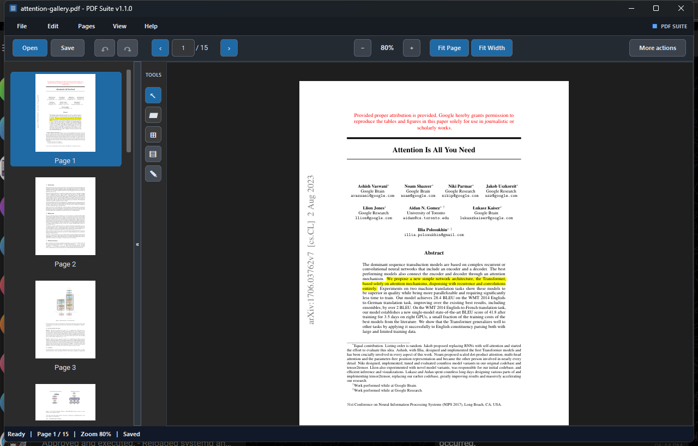
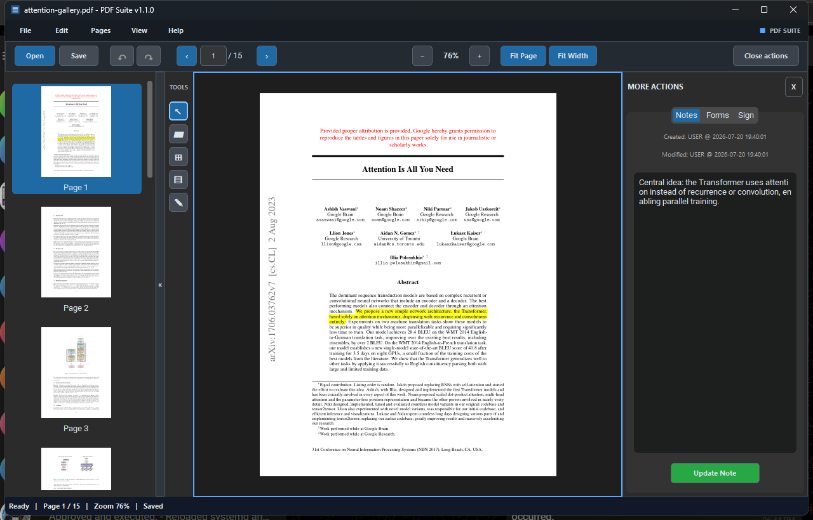
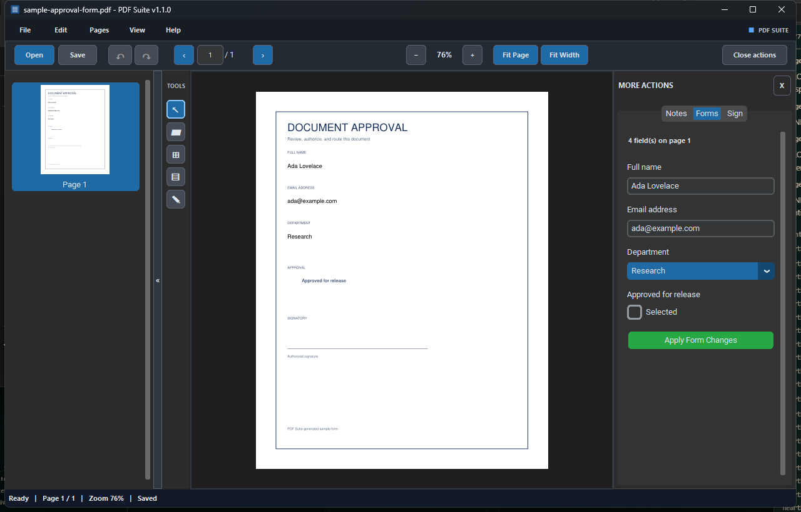
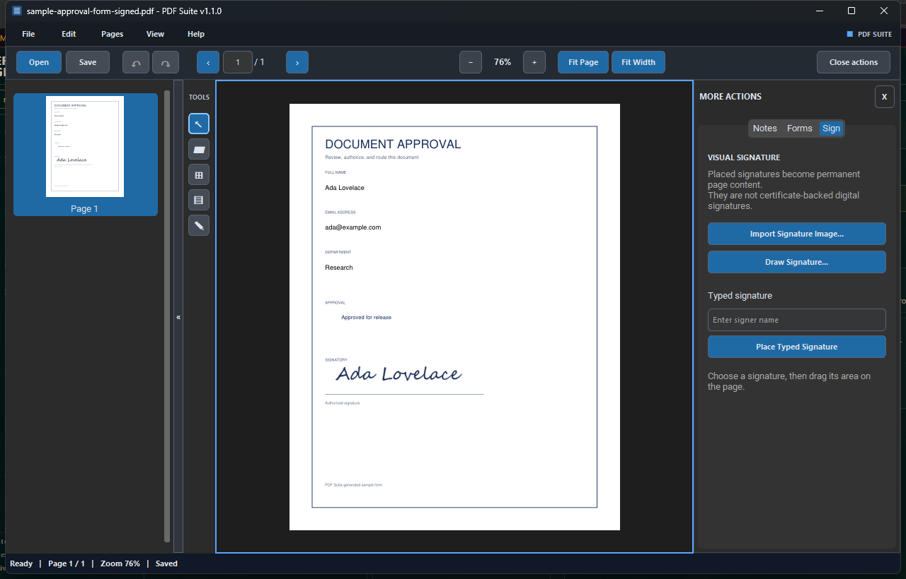
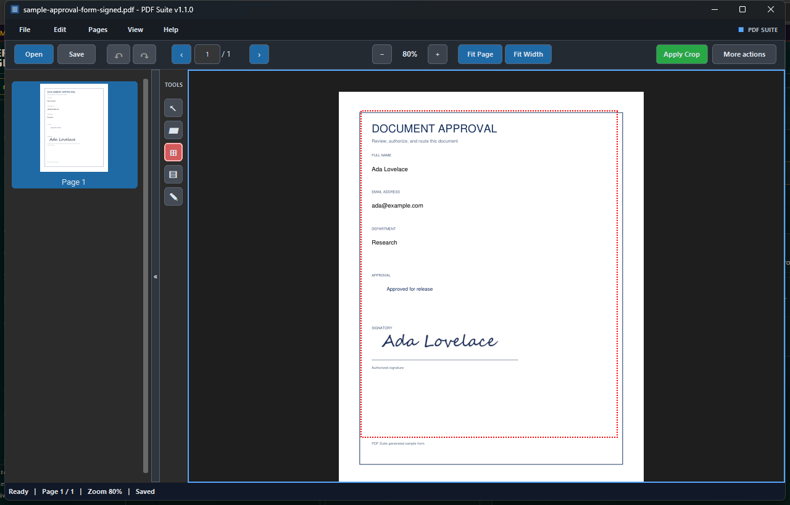
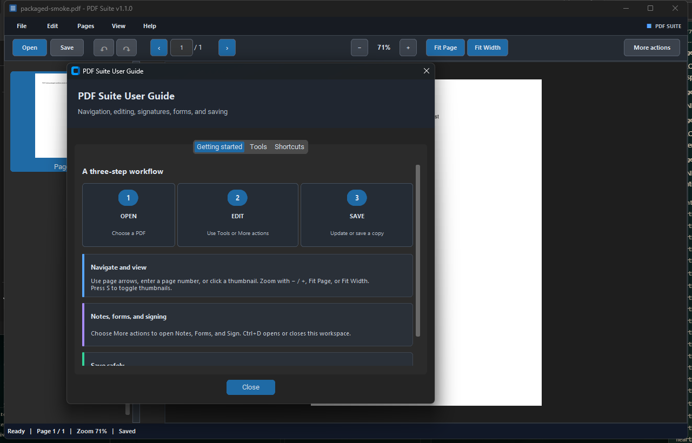
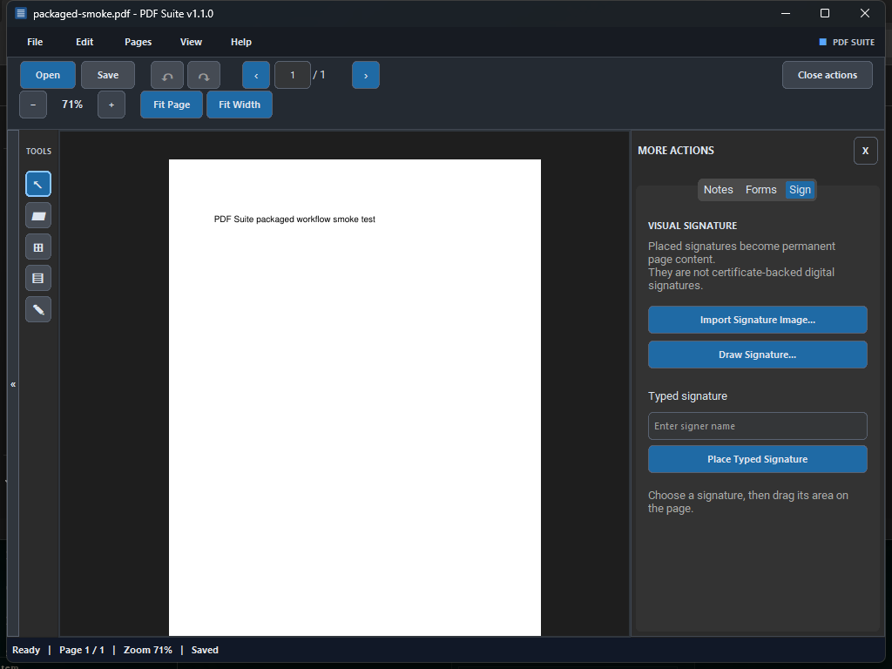

# PDF Suite

[](https://github.com/snguish/pdf-suite/actions/workflows/ci.yml)
[](https://github.com/snguish/pdf-suite/releases/latest)
[](LICENSE)

PDF Suite 1.1.0 is a local Windows desktop application for reviewing, annotating, filling, signing, and organizing PDF documents. Files are processed on the computer and are not uploaded to a remote service.

## Gallery

<p align="center">
  <a href="docs/images/pdf-suite-overview.png"></a>
</p>

<p align="center"><em>The central Transformer claim highlighted in <a href="https://arxiv.org/abs/1706.03762">Attention Is All You Need</a>: attention replaces recurrence and convolution while enabling more parallel training.</em></p>

| Review comments | Interactive forms |
| --- | --- |
| <a href="docs/images/pdf-suite-notes.png"></a> | <a href="docs/images/pdf-suite-forms.png"></a> |
| Attach an editable, timestamped review note to the highlighted key point. | Detect and edit generated text, choice, and checkbox fields. |

| Visual signatures | Visual page cropping |
| --- | --- |
| <a href="docs/images/pdf-suite-signatures.png"></a> | <a href="docs/images/pdf-suite-crop.png"></a> |
| A drawn signature is visibly placed on the form’s signatory line while the Sign workflow remains open. | A red selection boundary previews the exact page area retained by Apply Crop. |

| Illustrated user guide | Responsive workspace |
| --- | --- |
| <a href="docs/images/pdf-suite-user-guide.png"></a> | <a href="docs/images/pdf-suite-responsive.png"></a> |
| Open the tabbed guide from Help or with `F1`. | Toolbars and panels adapt to compact window sizes. |

## Features

- Render PDFs with page thumbnails, direct page navigation, fit-to-page, fit-to-width, and pointer-centered zoom.
- Highlight text or arbitrary regions and attach timestamped notes.
- Inspect and edit AcroForm text fields, checkboxes, radio buttons, combo boxes, and list boxes.
- Import, type, or draw a visual signature and place it as flattened page content.
- Select, move, resize, or delete signatures placed during the current editing session.
- Undo and redo document changes from the toolbar, Edit menu, or keyboard.
- Crop, rotate, reorder, delete, combine, and extract pages.
- Export a page as PNG or export notes as a formula-safe CSV file.
- Open a second window for side-by-side document review.
- Adapt the workspace for wide, compact, and narrow window sizes while retaining the dark interface.
- Learn the workflow through an illustrated, tabbed in-app User Guide.

> [!IMPORTANT]
> Visual signatures are images, not certificate-backed digital signatures. They do not verify signer identity or protect a document from later changes.

## Project resources

- [Releases](https://github.com/snguish/pdf-suite/releases) — portable Windows builds and checksums.
- [Changelog](CHANGELOG.md) — notable changes by version.
- [Contributing](CONTRIBUTING.md) — development setup and pull request checks.
- [Security policy](SECURITY.md) — supported versions and private vulnerability reporting.

## Run from source

Requirements:

- Windows 10 or later
- Python 3.11 or later
- [uv](https://docs.astral.sh/uv/)

From PowerShell in the repository root:

```powershell
uv sync
uv run python app.pyw
```

Open a PDF at startup by passing its path:

```powershell
uv run python app.pyw "C:\Documents\sample.pdf"
```

## Build the Windows application

Run:

```powershell
.\scripts\build_windows.ps1
```

The portable application is created at:

```text
dist\PDF Suite\PDF Suite.exe
```

Distribute the complete `dist\PDF Suite` directory. The executable depends on the adjacent packaged files.

The build script also places `LICENSE`, `README.md`, and `THIRD_PARTY_NOTICES.md` beside the executable. Keep those files with every distributed build.

## Main workflow

1. Select **Open** or pass a PDF on the command line.
2. Navigate with the thumbnail panel, page field, arrow controls, or mouse wheel.
3. Choose Pointer, Highlight, Crop, Forms, or Sign from the icon tool rail; hover an icon to see its name and shortcut.
4. Use **More actions** to work with Notes, Forms, and Sign controls.
5. Select **Save** to update the original after confirmation, or choose **Save Copy as...** from **File**.

Form edits are not applied automatically. Select **Apply Form Changes** before leaving the page or saving.

## Keyboard and mouse controls

| Input | Action |
| --- | --- |
| `Up`, `Page Up` | Previous page |
| `Down`, `Page Down` | Next page |
| Mouse wheel | Previous or next page |
| `Ctrl` + mouse wheel | Zoom around the pointer |
| `+`, `=`, numpad `+` | Zoom in |
| `-`, numpad `-` | Zoom out |
| `Ctrl+0` or `f` | Fit page |
| `Ctrl+1` or `b` | Actual size |
| `Ctrl+2` | Fit width |
| `Ctrl+O` | Open PDF |
| `Ctrl+S` | Update original file |
| `Ctrl+Shift+S` | Save a copy |
| `Ctrl+Z` | Undo the last document change |
| `Ctrl+Y` | Redo the last undone change |
| `Ctrl+E` | Export notes |
| `Ctrl+D` | Toggle More actions |
| `F1` | Open User Guide |
| `s` | Toggle thumbnails |
| `h` | Toggle highlight mode |
| `c` | Toggle crop mode |
| `Esc` | Cancel the active tool |
| `Delete` | Delete the selected visual signature |

Single-letter shortcuts are ignored while typing in an input control.

## Tests and verification

Run the automated tests with a workspace-local temporary directory:

```powershell
$env:PDF_SUITE_TEST_TMP = (Resolve-Path ".test-temp").Path
uv run python -m unittest discover -s tests -v
```

After building, run the packaged visual smoke check with a sample PDF:

```powershell
.\tests\visual_smoke.ps1 -PdfPath ".\sample.pdf"
```

Screenshots are written to `.test-temp\visual-smoke`. The script checks the normal workspace, User Guide, Highlight, Crop, More Actions, Forms, Sign, 800x600, and 1024x768 layouts.

## Limitations

- Certificate-backed PDF signing and validation are not implemented.
- Signature selection and geometry metadata are limited to signatures placed during the current editing session; reopening a saved PDF treats them as flattened page content.
- Undo and redo history is kept in memory for the current session and is limited to 50 document changes.
- Complex scripted forms and multi-page field groups need broader compatibility testing.
- The project currently produces a portable folder, not an installer or automatic file association.

See [technical documentation](docs/technical_documentation.md) for architecture and maintainer details.

## License

Copyright (C) 2026 PDF Suite contributors.

PDF Suite is free software licensed under the [GNU Affero General Public License, version 3 or later](LICENSE). It is distributed without any warranty; see the license for details.

Distributed executable builds must be accompanied by equivalent access to the complete corresponding source code, including the build scripts and dependency metadata needed to produce the build. Third-party components retain their own copyright and license terms; see [THIRD_PARTY_NOTICES.md](THIRD_PARTY_NOTICES.md).
